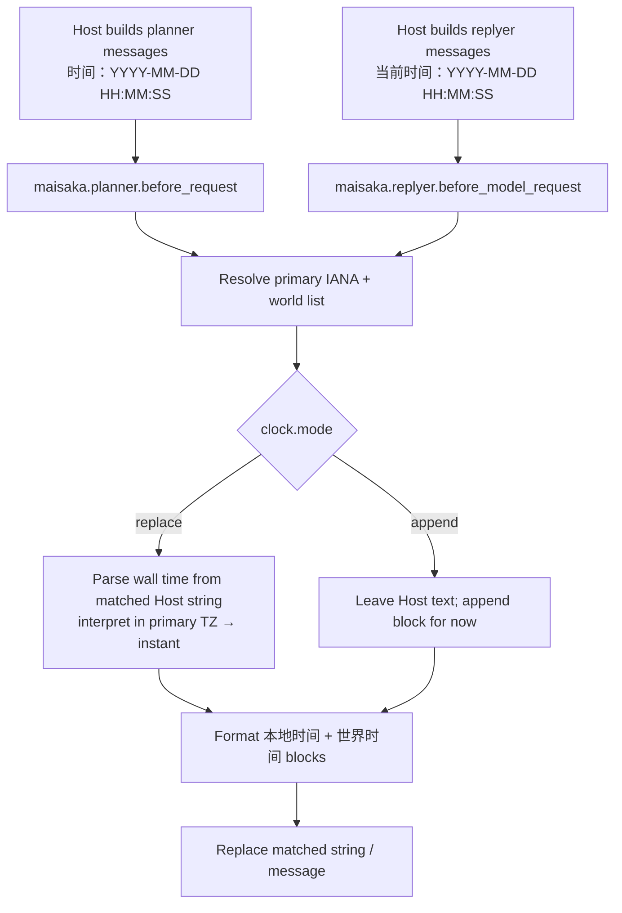

# maibot-world-clock — Design Spec

**Date:** 2026-07-28  
**Status:** Approved (brainstorming)  
**Plugin directory:** `maibot-world-clock/`  
**Display name:** 世界时钟（World Clock）  
**Architecture:** Dual-hook in-place rewrite, with configurable append-only fallback

## Summary

A MaiBot first-party plugin that rewrites Host-injected planner/replyer time prompts so the LLM sees timezone-aware **本地时间** plus a configurable **世界时间** list (default Asia/Shanghai + UTC). By default it **replaces** Host’s bare time strings; users can switch to **append-only** if Host’s wording changes. When replacing, the plugin always parses the wall time from the original message (including historic day-boundary markers), never substitutes wall-clock “now” for those rewrites.

## Problem

Host currently injects times without timezone, e.g. `时间：2026-07-28 23:24:00` / `当前时间：2026-07-28 23:24:00`. Group chats often mix Beijing participants with a PDT bot/operator; the model cannot tell which zone the stamp is in.

## Goals

- Show primary (local) time with IANA id + abbreviation
- Show configurable additional world timezones for the **same instant**
- Default world list: `Asia/Shanghai`, `UTC`
- Dedupe: never list primary again under 世界时间; omit 世界时间 block if empty after dedupe
- Replace Host time strings by default; optional append-only mode for Host format drift
- Cover planner (trailing current time + day-boundary markers) and replyer (`当前时间` section)
- Prompt injection only (no slash command / LLM tool in v1)
- Plugin-only; no Host/SDK source changes

## Non-goals (v1)

- Slash commands or `@Tool` world-clock queries
- Patching MaiBot Host time builders
- Invented Chinese city labels (IANA + abbr only)
- Rewriting non-Host time-like strings that do not match the documented patterns

## Decisions (from brainstorming)

| Topic | Choice |
|---|---|
| Host bare time | Replace in place (default); append mode configurable |
| Primary TZ | Process TZ by default; optional `primary_timezone` override |
| Day-boundary markers | Rewrite in replace mode (parse historic wall time) |
| Replyer | Yes — `maisaka.replyer.before_model_request` |
| Output shape | `本地时间` / `世界时间` blocks, IANA-first |
| Default world zones | `Asia/Shanghai`, `UTC` |
| Extra surface | Prompt hooks only |
| Implementation | Dual-hook rewrite; append as config fallback |

## Reference plugins / Host hooks

| Source | Patterns reused |
|---|---|
| `MaiBot-plastic-memory-plugin` | `@HookHandler` on `maisaka.planner.before_request`, message list rewrite |
| `maibot-image-recompress` | Config model, `config.default.toml`, version migration, smoke tests |
| Host `MaisakaChatLoopService` | Planner builds `时间：…` user messages (day boundary + trailing now), then fires `maisaka.planner.before_request` |
| Host `maisaka_generator_base` | Replyer final user message starts with `当前时间：…`; rewritable via `maisaka.replyer.before_model_request` |

---

## Architecture



### Components

1. **Config model** — `enabled`, `primary_timezone`, `world_timezones`, `mode`, `on_no_match`, config versioning.
2. **Timezone resolver** — primary IANA + normalized world list (deduped against primary).
3. **Clock formatter** (pure) — instant + zone lists → prompt text.
4. **Matchers / injectors** — planner whole-message vs replyer leading-line; replace vs append.
5. **Two `@HookHandler`s** — blocking, cheap (stdlib only; no I/O).

### Directory layout

```
maibot-world-clock/
  plugin.py
  _manifest.json
  config.default.toml
  README.md
  .gitignore
  docs/superpowers/specs/
    2026-07-28-maibot-world-clock-design.md
  tests/
    smoke_test.py
    test_formatter.py
    test_inject.py
```

All logic lives in `plugin.py` (Host Runner only reliably loads that entry module; no sibling-module imports).

---

## Output format

For a given instant:

```
本地时间：
- America/Los_Angeles (PDT): 2026-07-28 23:24:00
世界时间：
- Asia/Shanghai (CST): 2026-07-29 14:24:00
- UTC (UTC): 2026-07-29 06:24:00
```

Rules:

- First block is always exactly one primary line under `本地时间：`.
- `世界时间：` lists configured world zones **in config order**, after removing any entry whose normalized IANA equals primary.
- If the world list is empty after dedupe, omit the entire `世界时间` block (no empty heading).
- Line shape: `- {iana} ({abbr}): {YYYY-MM-DD HH:MM:SS}` (24h, no offset digits in the wall stamp; abbr carries zone identity with IANA).
- `UTC` and `Etc/UTC` normalize to the same zone for dedupe/validation; **render the label `UTC`** when the configured entry was `UTC` or `Etc/UTC`.
- Abbreviation is the zone’s display name at that instant (DST-aware), via `datetime.tzname()` on the aware datetime in that zone.

### Instant source (critical)

| Situation | Instant used |
|---|---|
| **replace** matched Host time string | Parse `YYYY-MM-DD HH:MM:SS` from that string; treat as wall time in **resolved primary** TZ → aware instant; convert that instant into all displayed zones |
| **append** new block | `datetime.now(tz=primary)` (true current time) |
| **replace** + `on_no_match=warn_and_append` fallback | Same as append: now in primary TZ |

Never use “now” when overwriting a matched historic or trailing Host time string.

---

## Host string matching

### Planner — `maisaka.planner.before_request`

Host pattern (entire user message text, stripped):

```text
时间：YYYY-MM-DD HH:MM:SS
```

- **replace:** every matching message is rewritten to the multi-block text for that message’s parsed instant (covers day-boundary markers and the trailing current-time message).
- **append:** leave matching messages unchanged; append **one** new user message at the end of `messages` with the formatted block for **now**.

### Replyer — `maisaka.replyer.before_model_request`

Host pattern: a user message whose text starts with:

```text
当前时间：YYYY-MM-DD HH:MM:SS
```

optionally followed by `\n\n` and more sections (target message, reply requirements, etc.).

- **replace:** parse the datetime on that leading line; replace **only** the leading time section with the multi-block text; preserve the remainder of the message after the first section break.
- **append:** leave `当前时间：…` intact; append the formatted **now** block as an additional `\n\n`-separated section on that same user message. If no message with a leading `当前时间：` exists, append a new trailing user message containing only the formatted now block.

### Multimodal / non-plain content

If message `content` is not a plain string, attempt to locate a sole or leading text part that matches the pattern and rewrite only that text part. If no safe text target exists, skip that message (do not strip images or tool payloads).

---

## Config

```toml
[plugin]
enabled = true
config_version = "1.0.0"

[clock]
# 可选：覆盖进程时区作为「本地时间」。留空 = 自动解析 Host 进程时区
# primary_timezone = "America/Los_Angeles"

# 世界时区（IANA）。自动去掉与 primary 相同的项；去重后为空则不渲染「世界时间」
world_timezones = ["Asia/Shanghai", "UTC"]

# replace = 改写 Host 时间字符串（默认）
# append  = 不改写，只追加（Host 文案变更时的兼容模式）
# mode = "replace"

# replace 下未匹配到 Host 时间字符串时：
#   warn_and_append — 打警告并为本次请求追加 now 块（默认）
#   warn_only       — 仅警告，不追加
#   error           — 抛错（由 Host 记录 Hook 失败；这些 Hook 不允许 abort 聊天）
# on_no_match = "warn_and_append"
```

### Validation

- `mode` ∈ `{replace, append}`; `on_no_match` ∈ `{warn_and_append, warn_only, error}`.
- Every configured IANA id must load via `zoneinfo.ZoneInfo` (after normalizing `UTC` → `Etc/UTC` for loading). Invalid ids **fail config validation** with the bad id named — no silent skip.
- `enabled = false` → hooks no-op (`continue`).

### Primary timezone resolution order

1. `clock.primary_timezone` if set (must be valid IANA).
2. Else `TZ` environment variable if it is a valid IANA name.
3. Else if `/etc/localtime` is a symlink into the zoneinfo database, use that zone name.
4. Else fail clearly: require user to set `clock.primary_timezone`.

Do not guess from a numeric UTC offset alone.

### Config versioning

Follow the shared first-party pattern: `CURRENT_CONFIG_VERSION`, migrate/normalize helpers (`merge_plugin_config_data` / `rebuild_plugin_config_data` / `validate_plugin_config`), ship `config.default.toml`. Do not hand-edit users’ live `config.toml` in docs/scripts beyond migration code.

---

## Hooks & capabilities

| Hook | Mode | Role |
|---|---|---|
| `maisaka.planner.before_request` | `BLOCKING` | Rewrite/append planner `messages` |
| `maisaka.replyer.before_model_request` | `BLOCKING` | Rewrite/append replyer `messages` |

`order`: `HookOrder.NORMAL`.

Manifest `capabilities`: `[]` (hooks need no capability proxies). `host_application` / `sdk` ranges match sibling first-party plugins (`min_version` Host `1.0.0` / SDK `2.5.1`, max `1.99.99` / `2.99.99`).

Lifecycle: required `on_load`, `on_unload`, `on_config_update`, and `create_plugin()`.

User-facing strings (WebUI field labels, log messages, README): 简体中文 first.

---

## Error handling

- Config errors: fail validation / load with explicit message.
- Hook path: keep handlers short; unexpected exceptions should follow SDK/`error_policy` defaults for non-abort hooks — prefer logging and `continue` only where the SDK contract requires not breaking chat; **do not** invent alternate clock text on formatter failure for a matched message (surface the error). Distinction: `on_no_match=warn_and_append` is an intentional configured fallback when the **pattern** is missing, not a silent catch-all for bugs.
- Performance: stdlib only (`zoneinfo`, `datetime`, `re`); target well under the Host’s ~50ms prompt-hook budget.

---

## Testing

Offline only (`PYTHONPATH=../maibot-plugin-sdk`); no running Host required for unit/smoke tests.

1. **Formatter** — primary PDT + Shanghai/UTC; primary already `Asia/Shanghai` → 世界时间 has only UTC; world empty after dedupe → no 世界时间; DST abbr differs across winter/summer instants; `UTC`/`Etc/UTC` dedupe.
2. **Replace inject** — planner whole-message rewrite; multiple day-boundary messages keep their own parsed instants (assert not equal to frozen “now”); replyer leading-line rewrite preserves trailing sections.
3. **Append inject** — Host strings unchanged; exactly one appended now-block.
4. **on_no_match** — replace with no match → warn_and_append adds now block; warn_only does not.
5. **Config** — bad IANA rejected; defaults match `config.default.toml`; enabled=false no-ops.

---

## Manifest / packaging sketch

- **id:** `com.0-hz.world-clock`
- **name:** `世界时钟（World Clock）`
- **author:** `kes` (`https://github.com/yufei-pan`)
- **license:** MIT
- **repository:** `https://github.com/yufei-pan/maibot-world-clock`
- Dependencies: none beyond SDK (stdlib `zoneinfo`)

---

## Implementation notes

- Parse Host timestamps with a strict regex: `^时间：(\d{4}-\d{2}-\d{2} \d{2}:\d{2}:\d{2})$` and `^当前时间：(\d{4}-\d{2}-\d{2} \d{2}:\d{2}:\d{2})(?:\n|$)`.
- Serialize/deserialize: hooks receive already-serialized prompt messages (`list[dict]`); mutate `content` strings and return `modified_kwargs` like plastic-memory.
- Do not modify Host or SDK in v1.

---

## Open points resolved in this spec

- Labels before IANA → none; use `本地时间` / `世界时间` section headers only.
- Historic times → always parse from Host string when replacing.
- Mode 1 vs 3 → `clock.mode = replace | append`, default `replace`.
- Replyer format differs from planner (`当前时间` vs `时间`) → separate matchers, shared formatter.
